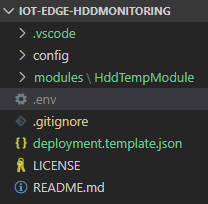

# IoT-Edge-HddMonitoring
An Azure IoT Edge module that uses hddtemp to monitor SMART values from the host HDD.

This demo uses [Hddtemp](https://savannah.nongnu.org/projects/hddtemp/) which needs to be executed with privileged permissions from a docker container. In addition another module *SimulatedTemperatureValues* will be deployed to show more data.

## Configuring the solution
VSCode will create a deplomyent manifest from the *deployment.template.json* file in the root folder. This template contains placeholder, that need to be defined in a **.env** file. You will need to create this file.



Use this codeblock as a startingpoint for the `.env` file and replace the values with your Azure Container Registry values.
```
CONTAINER_REGISTRY_ADDRESS=rene.azurecr.io
CONTAINER_REGISTRY_USERNAME=rene
CONTAINER_REGISTRY_PASSWORD=myfancysupersecretpasswordgoeshier
DRIVE_PATH=/dev/sda1
```
That's it. If you need more information, take a look at the [Tutorial: Develop and deploy a Python IoT Edge module for Linux devices](https://docs.microsoft.com/en-us/azure/iot-edge/tutorial-python-module).

## Extending the demo
How about the CPU temperature? Use [How to check CPU temperature on Ubuntu Linux](https://www.cyberciti.biz/faq/how-to-check-cpu-temperature-on-ubuntu-linux/) as a starting point to extend the demo to read the CPU temperature as well.